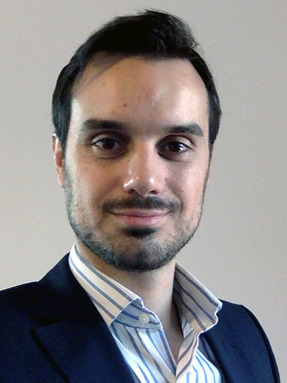

<!DOCTYPE html>
<html lang="en">
  <head>
    <meta charset="UTF-8">
    <meta name="viewport" content="width=device-width, initial-scale=1.0">
    <title>Felipe von Brasche Figueiredo- Résumé</title>
    <link rel="preconnect" href="https://fonts.gstatic.com">
    <link href="https://fonts.googleapis.com/css2?family=Caveat&family=Montserrat:wght@400;600&display=swap" rel="stylesheet">
    <link rel="stylesheet" href="css/styles.css">
  </head>
  <body>
    <main>
      <!-- ***********************  ABOUT / PROFILE  *********************** -->

      <header class="self-photo">
        
        

          <h1>Felipe von Brasche Figueiredo</h1>
          <h2>Mechanical and Automotive Engineer</h2>

          
Master of Sciences in Automotive and Engine Technology from the University of Stuttgart. Graduated in Mechanical Engineering from the State University of São Paulo in Brazil. Three years of professional experience as Project Engineer at Demag Cranes. Working Student at Lear Corporation in the Daimler CAD department. These work experiences helped me to become a professional with criteria, commitment, and responsibility. Interested in startups and analytics. Open to new challenges.

        

      </header>

      <!-- ********************  PROJECTS / PORTFOLIO  ********************* -->
      <!-- <section>
        <h2>Featured Projects</h2>
        
View selected projects below. More information can be found at <a href="http://christinatruong.com">christinatruong.com</a>.

        <!-- Copy the whole <section> block to add more projects. -->
        <!--<section>
          <h3>Project Name</h3>
          
          
Summary or description of the project and/or your role in it. Add as many paragraphs as you need.

          <a href="#" target="_blank">View project / case study</a>
        </section>
        <!-- End of Project block. -->
    <!--  </section>-->

      <!-- ***********************  WORK EXPERIENCE  *********************** -->
      <section class="work-experience">
        

          <h2>Work Experience</h2>
          <!-- Copy this whole <section> block to add more jobs. -->
          <section class="job-item">
            

              <h3>Working Student</h3>
              
Lear Corporation GmbH, Sindelfingen, Germany

              
Oct 2017 - Sep 2018

            

            

              <ul>
                <li>Creation of control sheets for the production of seat parts</li>
                <li>Management of the project working time database</li>
                <li>Analysis and documentation of seat defect points in cooperation with the quality and engineering departments</li>
                <li>Management of technical drawings in Siemens NX</li>
              </ul>
            

          </section>
          <section class="job-item">
            

              <h3>Project Engineer</h3>
              
Demag Cranes & Components, Cotia, Brazil

              
Nov 2011 - Okt 2014

            

            

              <ul>
                <li>Creation of technical drawings for the manufacture of overhead traveling cranes and their parts</li>
                <li>Calculation of the girder of the overhead traveling crane</li>
                <li>Order management of the materials required for the manufacture of the overhead traveling cranes</li>
                <li>Analysis of defect points in cooperation with production</li>
                <li>Cooperation in the translation of the parts catalog from German into Portuguese</li>
              </ul>
            

          </section>
          <!-- End of Job block. -->
          

      </section>

      <!-- ******************  EDUCATION & CERTIFICATIONS ****************** -->
      <section class="education">
        

          <h2>Education</h2>

          <!-- Copy this whole <section> block to add more schools. -->
          <section>
            <h3>University of Stuttgart - Stuttgart, Germany</h3>
            
Master of Sciences in Automotive and Engine Technology, Apr 2016 - Jan 2020

            
Focal points: Motor vehicles and car body construction

            <ul>
              <li>Master's thesis: Simulative Investigation for Potential Estimation of Electrified Exhaust Gas Turbochargers in a 48V Mild Hybrid</li>
              <li>Student Research Project: Evaluation of the characteristics and quality relevance of skid lines using FEM simulations of deep-drawing processes</li>
            </ul>
          </section>
          <section>
            <h3>São Paulo State University - Guaratinguetá, Brazil</h3>
            
Graduate Engineer in Mechanical Engineer, Mar 2005 - Jun 2011

            <ul>
              <li>Final Thesis: Oil Consumption by the Compressor of a Truck Engine</li>
            </ul>
          </section>
        

        <!-- End of School block. -->
      </section>
      <!-- *****************  CONTACT INFO / SOCIAL MEDIA  ***************** -->
      <footer>
        

          <h2>Let's Keep in Touch!</h2>

          <!-- Social media and contact links. Add or remove any networks. -->
          <ul class="contact-list">
            <li><a href="mailto:felipe@vonbrasche.com">felipe@vonbrasche.com</a></li>
            <li><a href="https://linkedin.com/in/felipe-von-brasche-figueiredo-99600939/?locale=en_US" target="_blank">LinkedIn</a></li>
          </ul>
        

      </footer>
    </main>
  </body>
</html>
